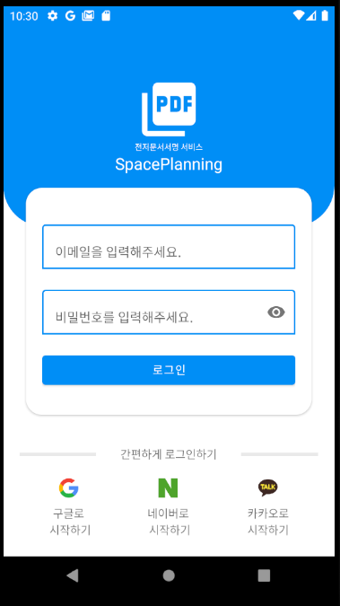
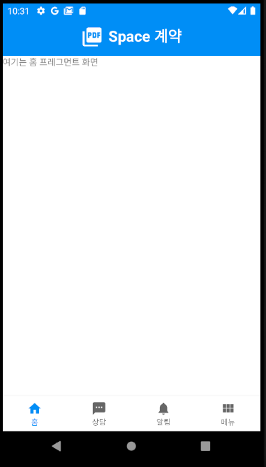
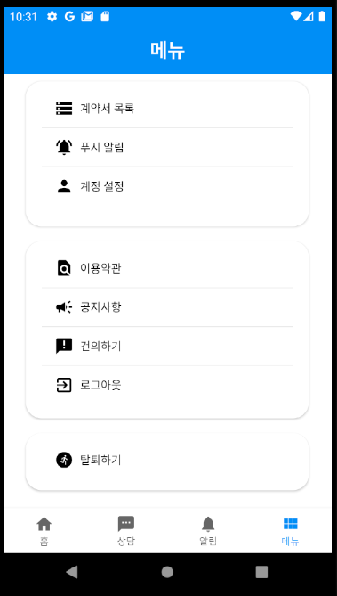
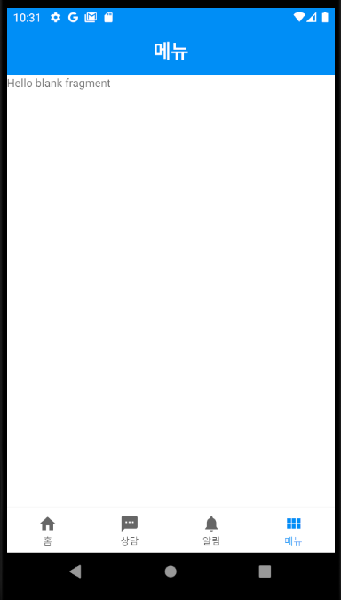

# 전자 계약서 앱 서비스

## 1. 안드로이드 및 eform-api를 이용하여 제작

## 2. 진행도

### 로그인 요청 화면
   - 
   
### 메인 화면
   - 
   
### 메뉴 화면
   - 
   
### 계정 정보 화면
   - 
   
## 2. 구조

- 1. Activity
    - Main
    - Login
    - Intro

- 2. Fragment
    - Home
    - Menu
    - Consulting
    - Notice
    - AccountSetting

## 3. 기능
    
- 1. MainActivity
    - BottumNav 기능 구현
    - Home, Consulting, Notice, Menu 순으로 제공
    - MenuFragment에서 여러 항목 중 계정 정보(AccountSetting)이동 가능
    
- 2. LoginActivity
   - Google, Naver, Kakao Login 기능 구축 예정
   - 현재 Naver 기능 구현 중, 로그인/로그아웃 동작 확인
   
## 4. 추가

1. 목표는 계약서 및 시공업체 연결 앱 서비스
2. 현재 계약 앱 서비스 설계 중
    - 1. 계약 성립을 위한 상호간 정보 입력 기능 필요
    - 2. 계약서 작성 전 업체 선정 여부, 하자보증권 등의 자료 첨부 기능 필요
    - 3. 계약서 작성 후 검토는 유료화(결제 시스템 필요)
   
## 5. 버그
- AccountSettingFragment에서 MenuFragment로 돌아올시 버그가 있음
- 되돌아오도로혹 하는 replaceFragment()메소드를 연속으로 2번 호출해야 /n Fragment 전환이 이루어짐
- 원인 못 찾음 :(
   

    

